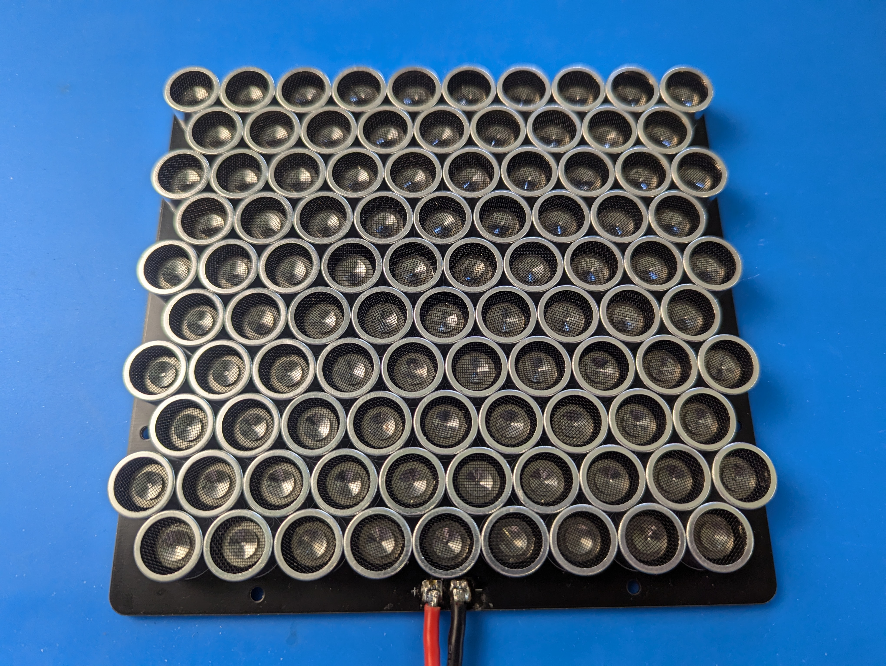

# Parametric Speaker

## What is this?

This is a directional speaker based on a parametric array of 95x 16mm 40kHz ultrasonic transducers.

The driver part of this design is currently only a working proof of concept and has some issues.
It consists of a single H-bridge directly driving the transducers with a 40kHz square wave without any additional filtering or matching.
The MOSFETs get really hot during the operation.

## Phase matching

Some transducers come with their polarity flipped even if they are from the same batch.
Thus it is important to match the phase of all of the transducers using the steps below:

1. Connect an oscilloscope to the receiver
2. Supply a 40kHz sine wave to the transducer
3. Physically align the transducer and the receiver in such a way that the wave supplied to the transducer has the same phase as the signal coming from the receiver
4. You now can mark the + and the - signs on this transducer-receiver pair and use it as the new reference.
5. Place a new transducer at the same distance from the receiver as the previous one and see if the phase is approximately the same between the two signals
6. If the phase does not match, flip the polarity of the transducer and it should now match
7. Insert the transducer into the PCB making sure that you insert it with the correct polarity according to the reference transducer polarity marked in step 4
8. Repeat steps 5-7 until you run out of transducers

## Additional Notes

The PCB assumes that the transducer bodies are electrically isolated from each
of the 2 pins. Not checking this may result in an unusable array due to a short.
Get transducers with a plastic housing if you want to avoid this.
